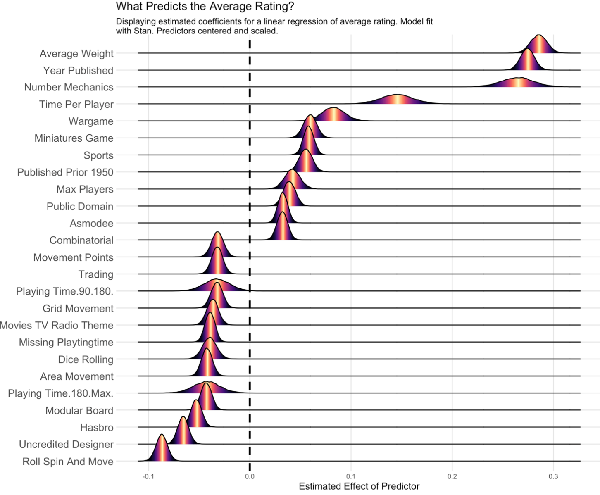
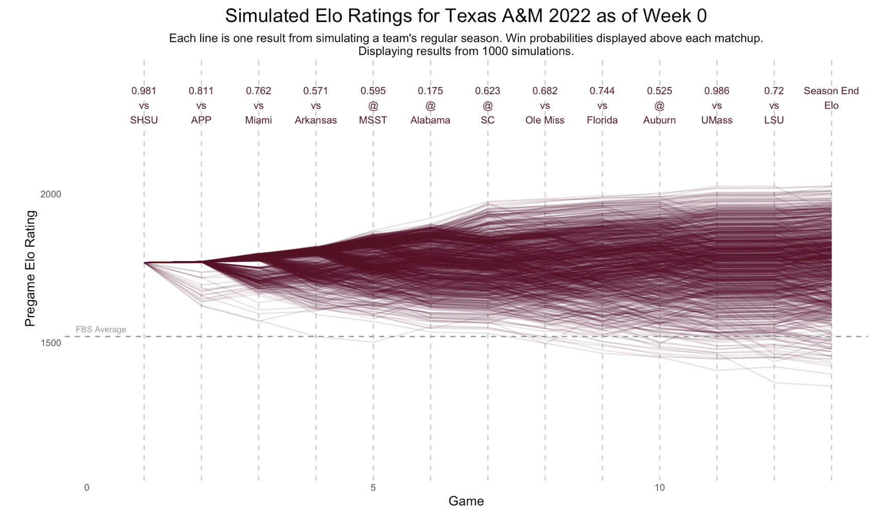
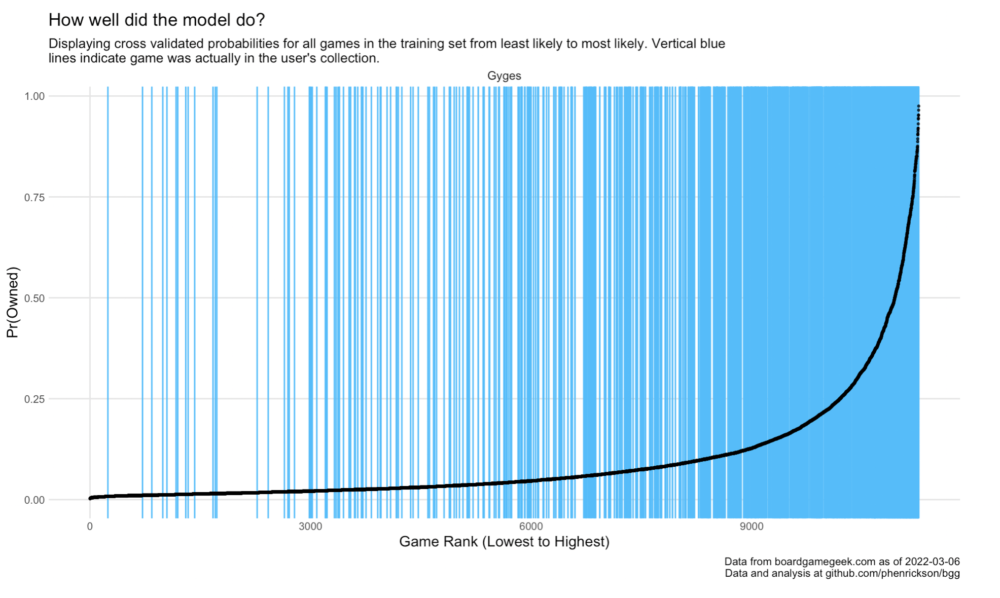
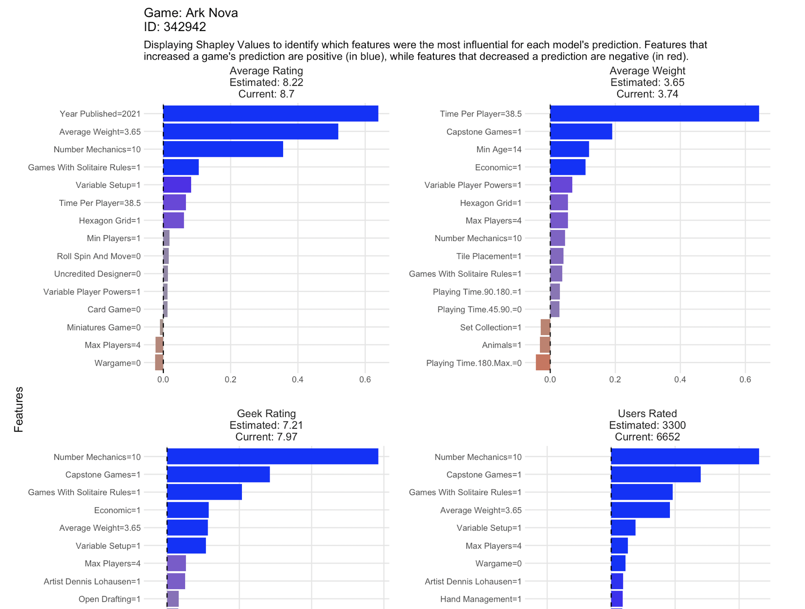
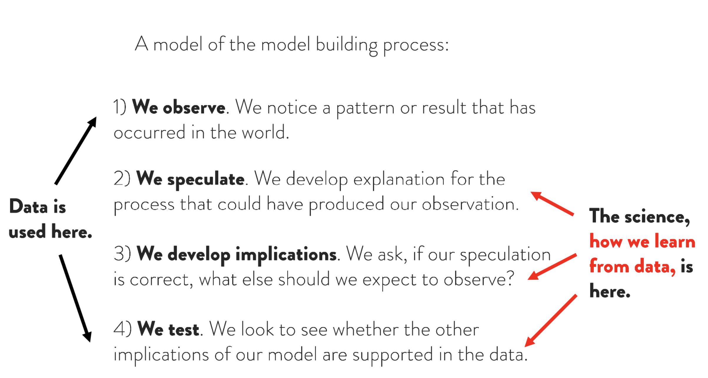
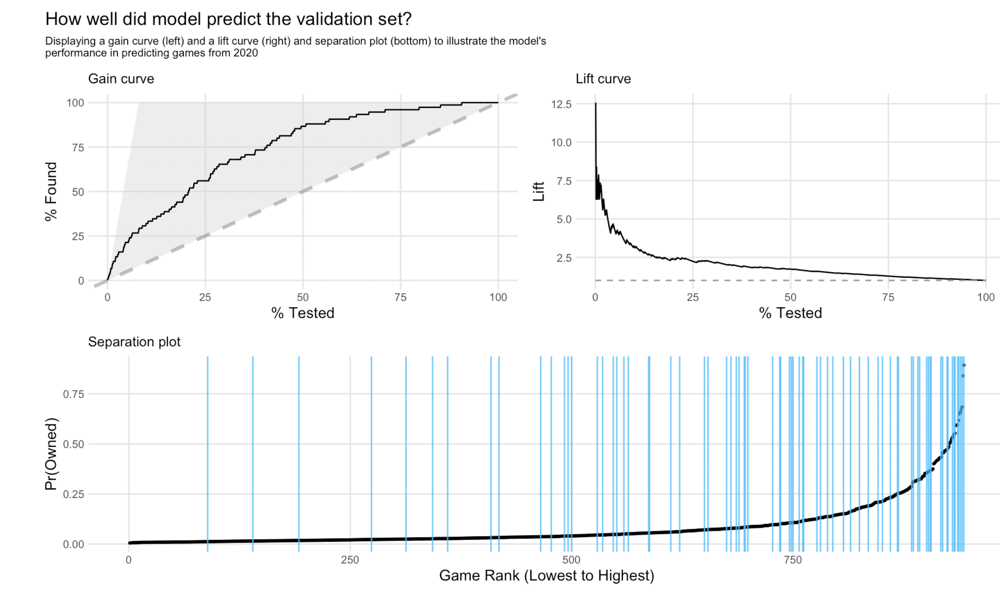
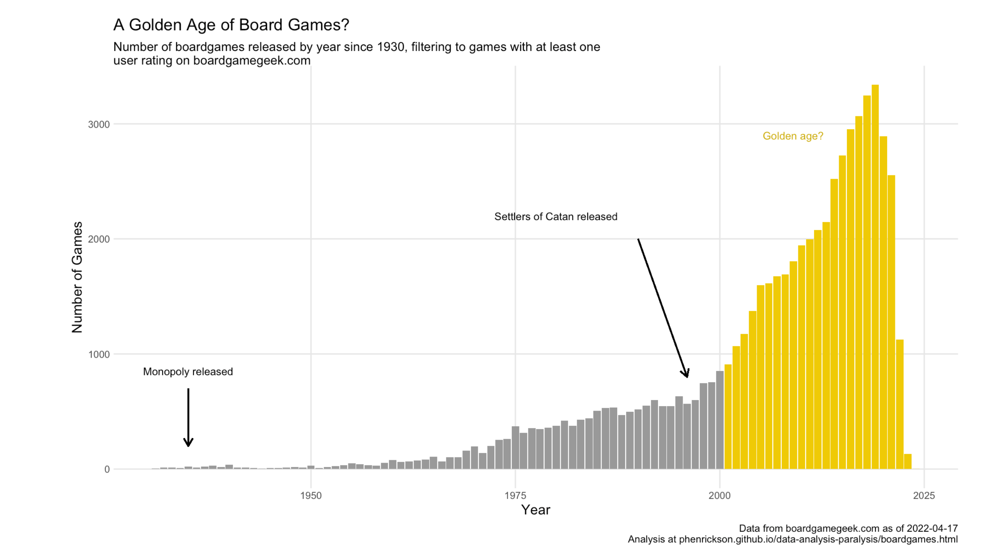
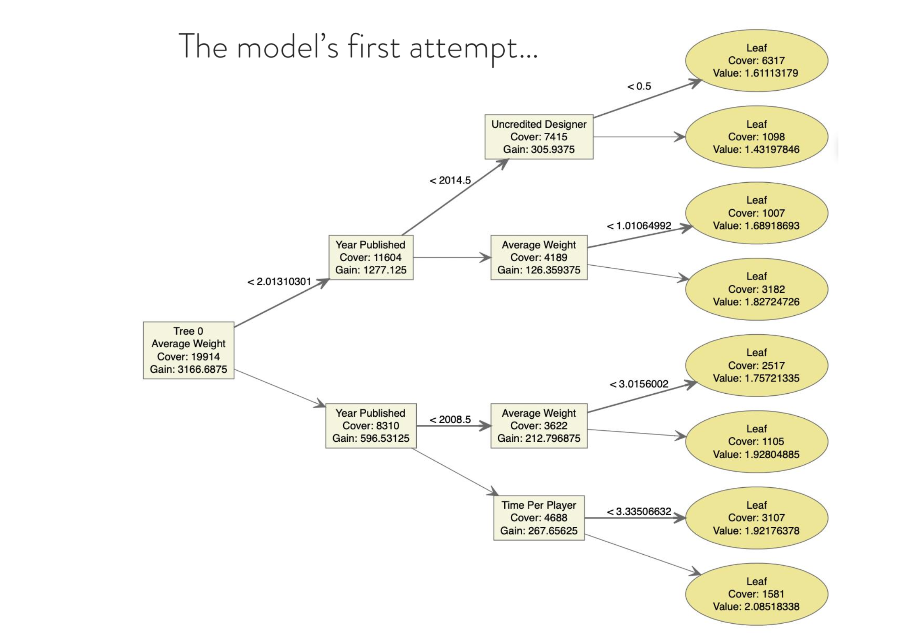

# What is this?

My name is Phil Henrickson and I work as a consulting data scientist in Madison, Wisconsin for AE Business Solutions. I help clients and organizations in the areas of predictive modeling, statistical/machine learning, and data visualization. Prior to consulting, I completed my PhD in political science at Florida State University 2018, where I taught courses on international relations, political violence, and civil war. 

This website serves as a repository for some of my side projects - I love using techniques from data science to (over) analyze the world of boardgames, sports and other things. Click on the links above to check out a few of my projects as well as talks I've given at various analytics symposiums. 

---

{width=45%} {width=40%}

---

{width=48%} {width=45%}

---

{width=48%} {width=40%}
---

{width=48%} {width=40%}

---

{width=48%} {width=40%}